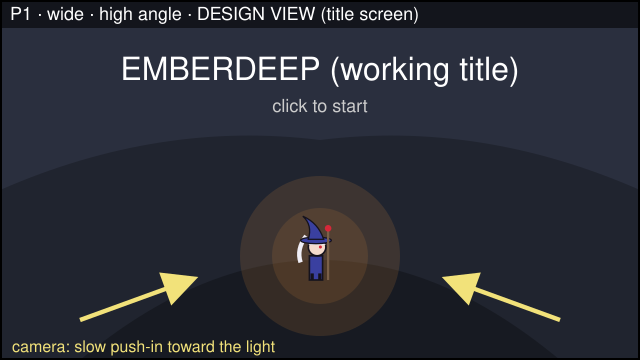
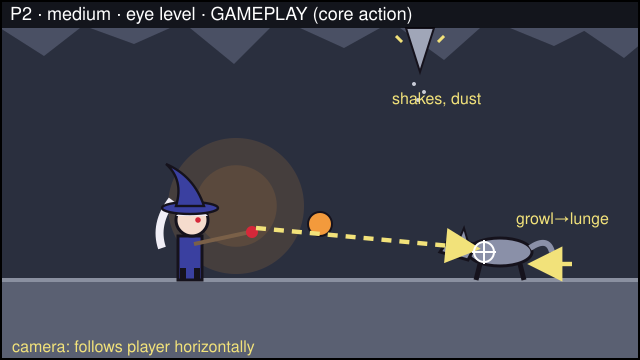
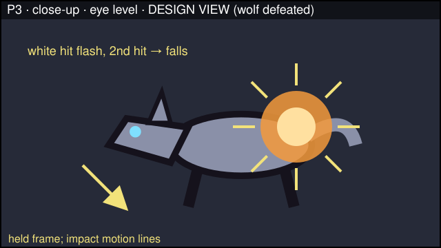
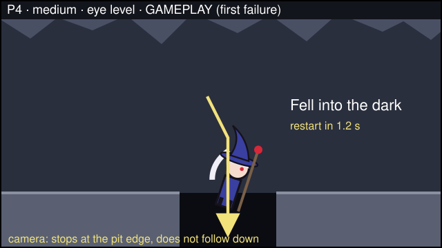
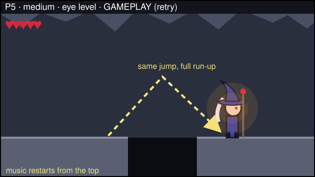
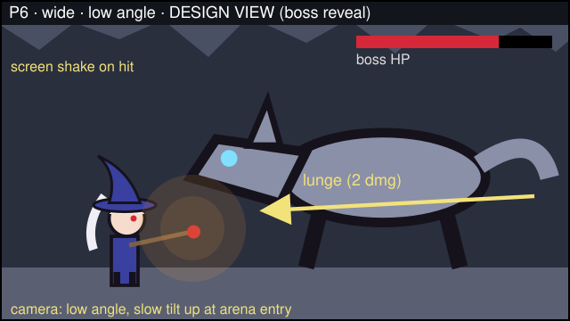
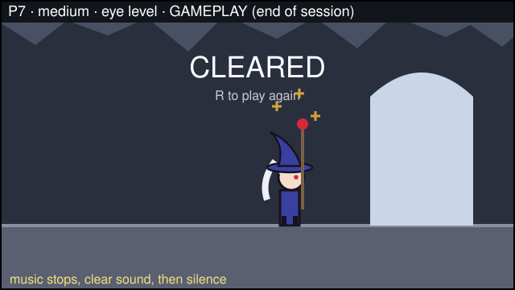

# STORYBOARD — the play experience, in order

> Draft v1 — written before any generation. Frame shape 16:9 throughout. Thumbnails are code-drawn by Claude from my shot decisions (not generated assets); contact sheet: `design/storyboard/contact-sheet.png`.
> Coverage: views wide (P1, P6), medium (P2, P4, P5, P7), close-up (P3); angles high (P1), eye level (P2–P5, P7), low (P6); motion on P1, P2, P3, P4, P5, P6. Gameplay panels show the real game camera (side view, eye level, follows the player); design views are labeled.

## Panel 1 — First thing the player sees

- Shot: wide · high angle · DESIGN VIEW (title screen) · motion: slow camera push-in toward the light
- Player action: clicks to start; the game fades into the first gameplay screen
- See: a tiny mage at the bottom of a vast dark cave, the staff's warm glow the only light; title and "click to start"
- Hear: MUS-LOOP starts, quiet
- Assets: ENV-BG, CHAR-IDLE, MUS-LOOP
- Design reason (pillar "your fire is the only warmth"): the player should feel small and alone, with one light to follow

## Panel 2 — Core action

- Shot: medium · eye level · GAMEPLAY · motion: fireball path from the staff to the crosshair, wolf lunge arrow, stalactite shake marks; camera follows the player horizontally
- Player action: aims with the mouse and casts at a growling wolf while a stalactite above starts to shake; the game spawns a fireball toward the cursor and starts the wolf's lunge after its growl
- See: CHAR-CAST, the crosshair on the wolf, the wolf in its growl pose, the shaking stalactite with falling dust
- Hear: SFX-CAST on release, SFX-ROCK when the stalactite starts shaking; music playing
- Assets: CHAR-CAST, FX-FIREBALL, UI-CROSSHAIR, ENEMY-WOLF, ENV-STALACTITE, ENV-TILES, SFX-CAST, SFX-ROCK, MUS-LOOP
- Design reason (pillar "every failure is fair"): every threat announces itself first, so the player decides what to deal with

## Panel 3 — Success

- Shot: close-up · eye level · DESIGN VIEW (held frame of the moment of impact) · motion: impact lines
- Player action: the second fireball hits; the game flashes the wolf white, sets it dead and plays its defeat
- See: FX-BURST on the wolf, white hit flash, wolf collapsing (ENEMY-WOLF defeated frame)
- Hear: SFX-WOLF-DOWN once; music playing
- Assets: ENEMY-WOLF, FX-BURST, SFX-WOLF-DOWN
- Design reason (pillar "readable at a glance, even muted"): the hit must be visible without sound — flash first, then the fall

## Panel 4 — First failure

- Shot: medium · eye level · GAMEPLAY · motion: fall arrow down into the pit; camera stops at the pit edge and does not follow
- Player action: jumps short and falls; the kill zone calls fail(), physics stops, the scene reloads after 1.2 s
- See: CHAR-FAIL falling, the dark pit between two clearly marked edge tiles, the text "Fell into the dark"
- Hear: music stops, SFX-FAIL once
- Assets: CHAR-FAIL, ENV-TILES, SFX-FAIL, MUS-LOOP
- Design reason (pillar "every failure is fair"): the cause stays on screen, and the pit is wide enough to see and short enough to clear

## Panel 5 — Retry

- Shot: medium · eye level · GAMEPLAY · motion: jump arc over the same pit
- Player action: after the restart, takes a full run-up and clears the pit; the game restores 5 HP and the heal
- See: CHAR-RISE / CHAR-FALL over the pit, CHAR-IDLE on landing, full hearts in the HUD
- Hear: music restarts from the top
- Assets: CHAR-RUN, CHAR-RISE, CHAR-FALL, CHAR-IDLE, UI-HEART, ENV-TILES, MUS-LOOP
- Design reason (pillar "every failure is fair"): the retry is immediate and the same jump now succeeds, so the player wants one more try

## Panel 6 — Boss

- Shot: wide · low angle · DESIGN VIEW (arena entry moment; in play the camera stays eye level) · motion: slow tilt up on entry, lunge arrow, screen shake on a 2-damage hit
- Player action: enters the flat arena, dodges lunges by jumping, casts during the pause after each lunge, channels the heal when safe
- See: the great wolf at 2× scale, boss HP bar, CHAR-HURT with blink after a hit, gold heal glow
- Hear: SFX-HURT when hit, SFX-HEAL when the channel completes, SFX-CAST; music playing
- Assets: ENEMY-WOLF (2×), CHAR-CAST, CHAR-HURT, FX-HEAL, UI-HEART, UI-HEAL, SFX-HURT, SFX-HEAL, SFX-CAST, MUS-LOOP
- Design reason (pillar "small mage, big threat"): the boss should fill the frame, while its pauses show the player it can be beaten

## Panel 7 — End of a play session

- Shot: medium · eye level · GAMEPLAY
- Player action: walks into the opened exit; the game sets cleared, stops input and shows the Cleared screen
- See: CHAR-WIN with the staff raised, pale daylight from the exit, "CLEARED" and "R to play again"
- Hear: music stops, SFX-CLEAR once, then silence
- Assets: CHAR-WIN, ENV-EXIT, SFX-CLEAR
- Design reason (pillar "your fire is the only warmth"): the first light that is not hers marks the end
